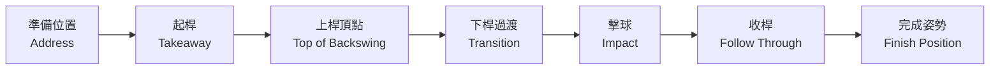

# 🏌️ 第一次揮桿 (Your First Swing)

## 概覽 (Overview)

高爾夫揮桿是一個複雜的連續動作，但對初學者來說，最重要的是建立自然、可重複的基礎揮桿動作。本指南將揮桿分解為幾個簡單的階段，讓您循序漸進地掌握整個動作。不要追求完美，而是追求動作的一致性與流暢感。

---

## 何時使用 (When to Use)

- 🎯 第一次到練習場打球時
- 🔄 重新建立揮桿基礎時
- 📐 感覺揮桿動作混亂、不穩定時

---

## 技術分解 (Technique Breakdown)

### 1. 準備動作 (Setup)

在揮桿之前，回顧並確認以下要點（參考[基本站姿與握桿](./04-basic-stance.md)）：

```
✓ 握桿正確（中等握力）
✓ 站距適當（肩寬）
✓ 膝蓋微彎
✓ 臀部後推、背部直立
✓ 桿面對準目標
✓ 身體平行於目標線
```

---

### 2. 握桿 (Grip)

使用互扣式或交叉式握法，確保：
- 握力維持4-6分（1-10分制）
- 兩手「V」形指向右肩（右手球手）
- 手腕保持靈活，不要僵硬

---

### 3. 站姿 (Stance)

以7號鐵桿練習為例：
- 腳距與肩同寬
- 球位於站距中心
- 重心均勻分佈

---

### 4. 揮桿路徑 (Swing Path)

高爾夫揮桿可以分為四個主要階段：

#### 階段一：上桿 (Backswing)

```
起始位置
    ↓
肩膀轉動，手臂帶動球桿向上
    ↓
桿身平行地面（半揮桿位置）
    ↓
手臂繼續上升至頭部高度
    ↓
頂部：左肩轉至下巴下方（右手球手）
```

**上桿關鍵要點：**
- 以**肩膀轉動**為主動，而非手臂
- 重心自然移向右腳（右手球手）
- 左膝指向球的方向
- 桿面在頂部應指向天空

#### 階段二：下桿起始 (Downswing Transition)

這是揮桿中最關鍵、最容易出錯的時刻：

> 💡 **最重要的概念**：下桿從**臀部開始**，而非肩膀！

```
頂部位置
    ↓
臀部向左轉動（右手球手）
    ↓
肩膀跟隨臀部轉動
    ↓
手臂自然下落
    ↓
擊球
```

#### 階段三：擊球點 (Impact)

擊球瞬間的理想位置：
- 手部位於球的略前方（向目標方向偏）
- 臀部已轉向目標
- 雙腿積極向目標方向推進
- 頭部保持在球後方

#### 階段四：收桿 (Follow Through)

好的收桿反映了之前動作的品質：
- 身體充分轉向目標方向
- 大部分重心移至左腳
- 右腳腳跟離地，腳尖支撐
- 球桿高舉過頭，繞過背部

---

### 5. 擊球點 (Impact Position)

**理想擊球點的視覺記憶：**

```
        桿頭移動方向 →
              ↓
        [桿面接觸球的瞬間]

手部位置：比球頭早一點到達目標方向
重心：65-70% 在左腳
臀部：已轉向目標約45度
肩膀：仍略微垂直於目標線
```

---

### 6. 收桿 (Follow Through)

**平衡收桿的檢驗方法：**

擊球後，保持收桿姿勢直到球落地：
- 如果需要挪步保持平衡 → 揮桿速度太快或重心不穩
- 如果右腳完全離地 → 重心轉移良好
- 如果背部面對目標 → 轉體充分

---

## 🔄 完整揮桿序列圖



---

## 常見錯誤 (Common Mistakes)

| 錯誤 | 原因 | 修正方法 |
|------|------|----------|
| 揮桿過猛（Over-swinging）| 想要擊遠 | 先練習70%力量揮桿，找到穩定的擊球感 |
| 抬頭（Head Up）| 急於看球的飛行 | 聽到擊球聲後再抬頭 |
| 上桿用手臂而非肩膀 | 肩膀轉動不足 | 練習雙手交叉胸前的轉體動作 |
| 下桿先動肩膀 | 動作順序錯誤 | 記住「臀部先動，肩膀後動」|
| 收桿不完整 | 轉體不夠 | 練習「字母C」收桿：側面看起來像字母C |
| 揮桿太快 | 緊張或興奮 | 使用節拍器，以慢速建立動作感覺 |

---

## 練習訓練 (Practice Drills)

### 訓練一：半揮桿練習（最重要！）
1. 以7號鐵桿練習
2. 只做半揮桿（桿身平行地面到平行地面）
3. 重點感受：肩膀轉動、擊球後桿面角度
4. 重複50次，直到動作自然

### 訓練二：分段揮桿（Stop and Go）
1. 上桿到頂部，**停止**
2. 確認頂部位置正確（桿面向天空、左肩轉到下巴下方）
3. 緩慢下桿，**停止**在擊球位置
4. 確認手部位置正確
5. 繼續完成揮桿
6. 重複20次

### 訓練三：腳距合攏練習
1. 雙腳靠攏（站距歸零）
2. 用此站距揮桿擊球
3. 這個練習強迫身體找到正確的重心轉移
4. 每次練習打20球

### 訓練四：節拍揮桿
1. 使用手機節拍器App，設定60 BPM
2. 以「1（上桿起步）、2（到頂部）、3（擊球）」的節奏揮桿
3. 幫助建立規律、可重複的揮桿節奏

---

## 進階提示 (Pro Tips)

> 💡 **距離不是第一優先**：初學者應先追求「擊球感覺」和動作的「一致性」，而非距離。一個一致的短距離揮桿，遠比一個不穩定的遠距離揮桿更有價值。

> 💡 **拍攝自己的揮桿**：使用手機慢動作功能錄下自己的揮桿，從正面和側面各錄一次。與教學影片對比，通常能快速發現問題。

> 💡 **溫習，不是重來**：當某次揮桿感覺特別好，立刻用心記憶那個感覺，然後重複。建立「成功揮桿的感覺記憶」是快速進步的關鍵。

---

## 🔗 相關技術 (Related Techniques)

- [基本站姿與握桿](./04-basic-stance.md) - 揮桿的前置基礎
- [鐵桿技術](../02-intermediate/01-iron-play.md) - 進一步精進鐵桿揮桿
- [練習訓練計劃](../06-reference/practice-drills.md) - 系統化練習安排

---

*← [上一篇：基本站姿與握桿](./04-basic-stance.md)　｜　[前往中級課程 →](../02-intermediate/README.md)*
